# Installing Cleanroom Loader on Android

::: warning Disclaimer {id="disclaimer"}
This guide is for **Zalith Launcher 2** only. At the time of writing, it is the most feature-complete launcher still in active development that has added Cleanroom Loader compatibility. Most other Android launchers are either abandoned, poor quality, or have issues when running Cleanroom Loader.
:::

This guide assumes you already know the basics of Zalith Launcher 2 (ZL2) and have set up everything beforehand.

## Method 1: Built-in Installer

### 1. Open the download screen

On the main screen within ZL2, tap the **Download** icon at the top.

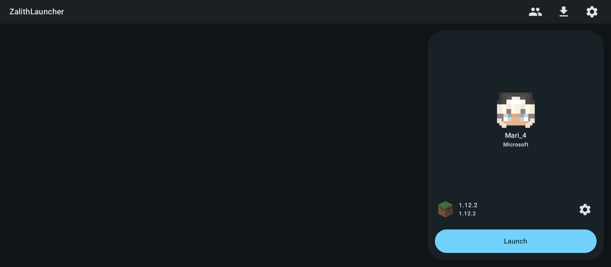

### 2. Select Minecraft 1.12.2

Look for the **1.12.2** version and select it.

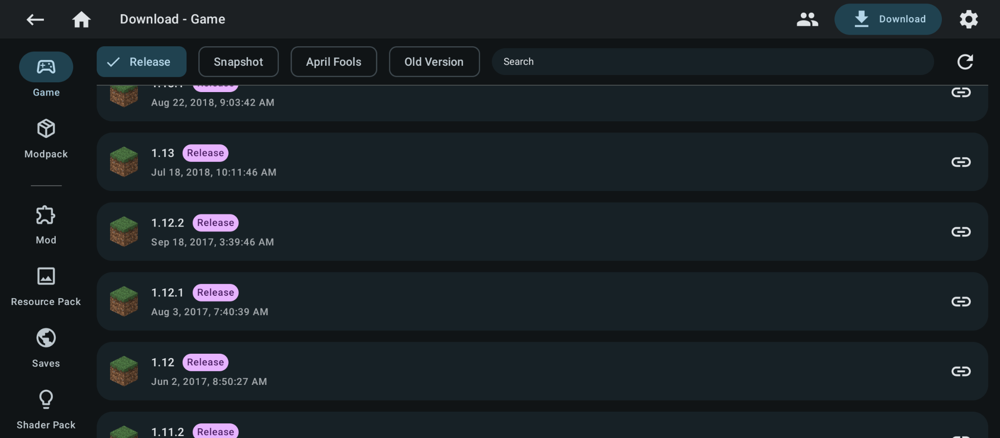

### 3. Choose a Cleanroom version

You will be shown all available mod loaders; select a **Cleanroom** version of your choosing.

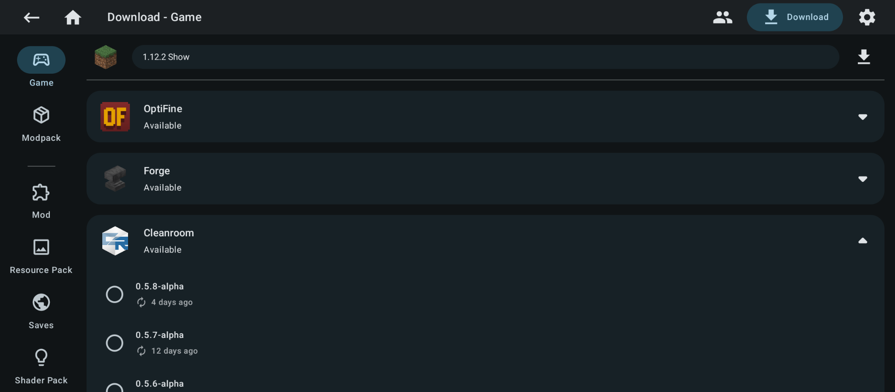

### 4. Start the download

Once selected, tap the **textless Download icon** that is **below** the gear icon. Do **not** tap the button that says “Download”.

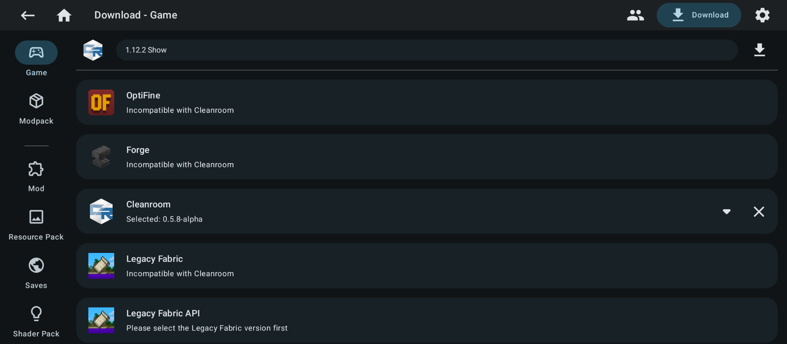

### 5. Wait for the download

The download will start.

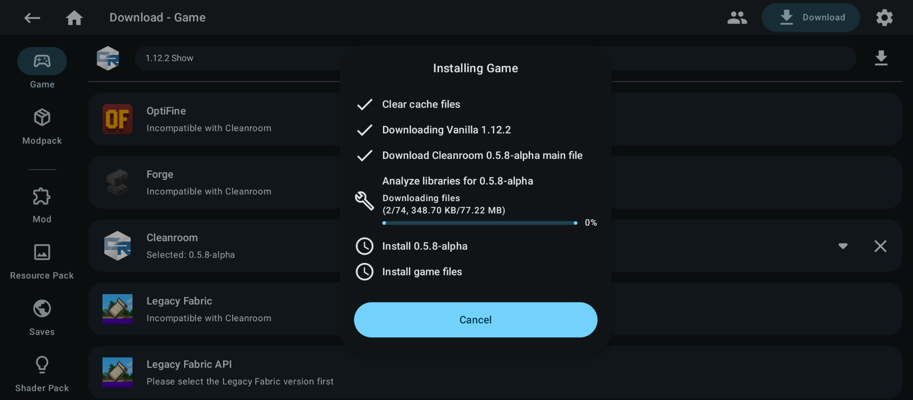

### 6. Ready to play

When it finishes, you are ready to play Minecraft 1.12.2 with Cleanroom Loader.

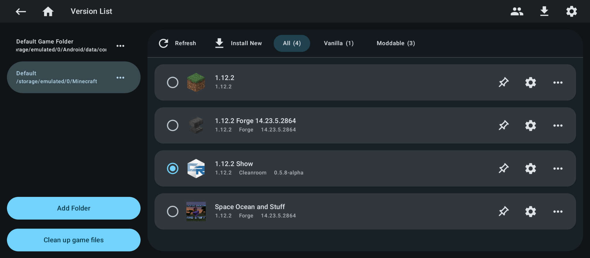

## Method 2: Manual Installation

Sometimes ZL2 cannot fetch the Cleanroom version list on its own. If that happens, you can still install Cleanroom manually by downloading the installer `.jar` file from the [Cleanroom releases page](https://github.com/CleanroomMC/Cleanroom/releases).

### 1. Open global settings

Tap the gear icon in the top right to open the global settings screen.

### 2. Execute the installer jar

Open the **Java** section on the left, then tap **Execute Jar**.

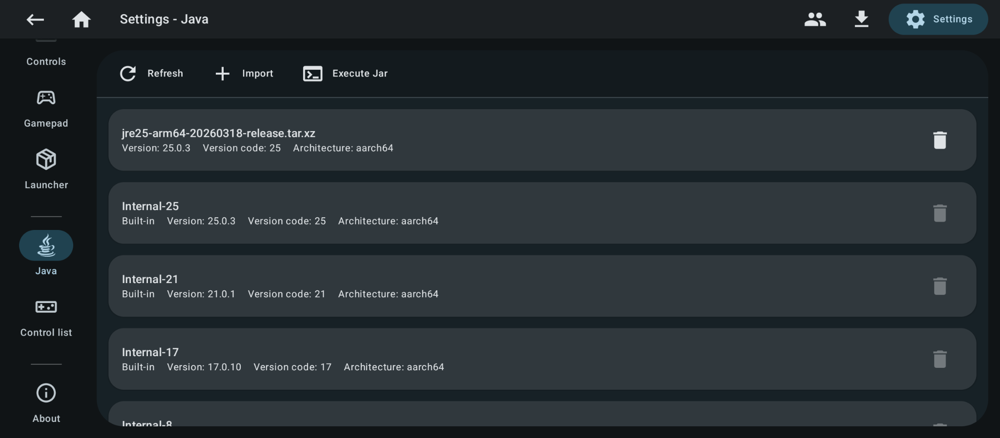

### 3. Point the installer at Zalith’s Minecraft folder

Run the Cleanroom installer jar. The installer may not immediately recognize where Zalith’s Minecraft folder is installed. If so, point it there manually (in the first screenshot below, the automatically selected folder is wrong).

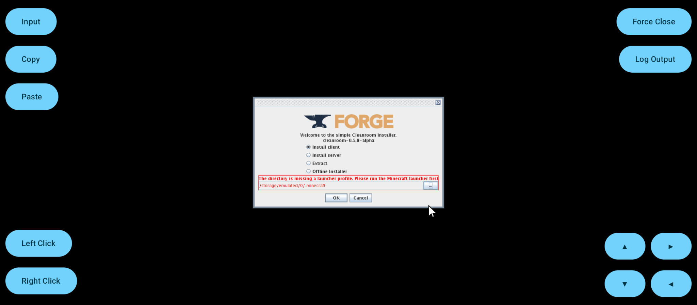

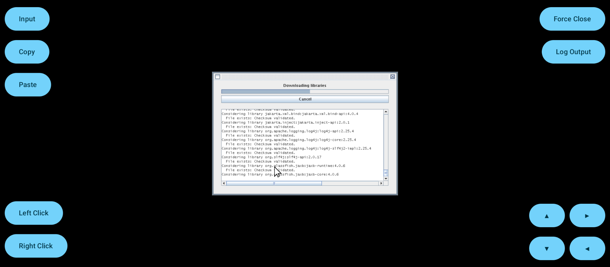

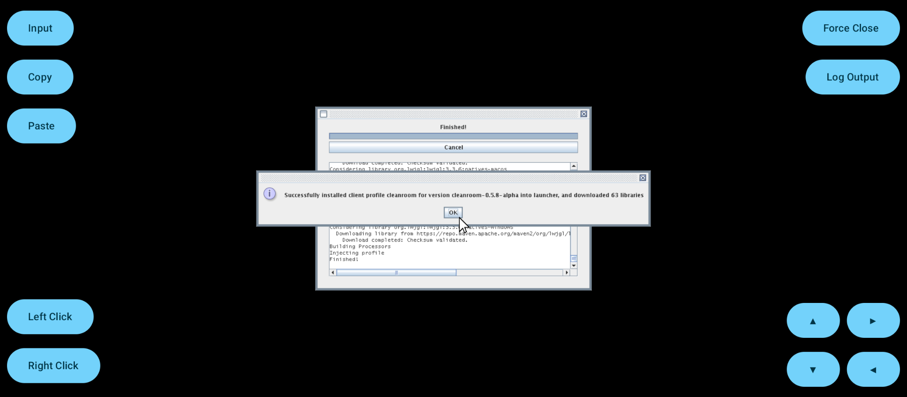

## Converting Non-Cleanroom Instances to Cleanroom Loader

When downloading a modpack, you cannot select Cleanroom Loader as a mod loader option. Installing Cleanroom Relauncher (or one of its forks) either does not work or crashes the game on Android. Zalith Launcher 2 has a built-in way to switch an existing instance over.

### 1. Open the instance settings

Tap the gear icon next to your currently selected instance.

### 2. Remove Forge

Open **Update Loader** on the left. You will see Cleanroom Loader listed, but first remove Forge by tapping the **X** icon.

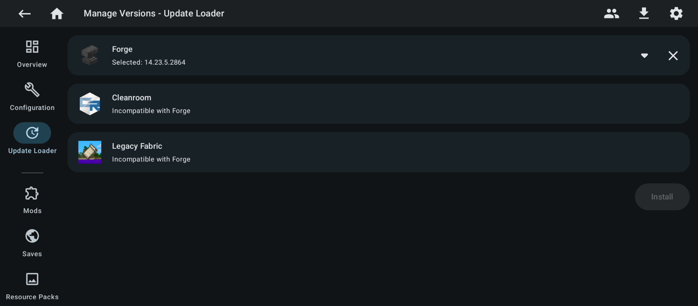

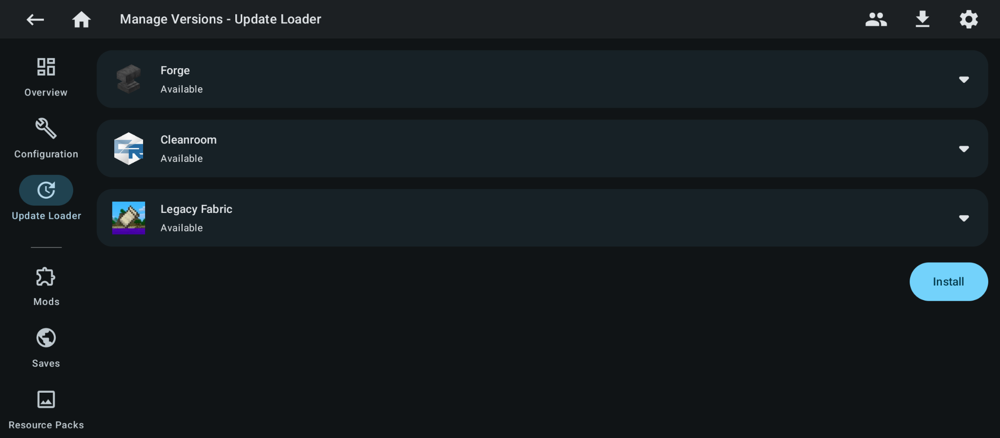

### 3. Select Cleanroom

Select the Cleanroom version of your choosing.

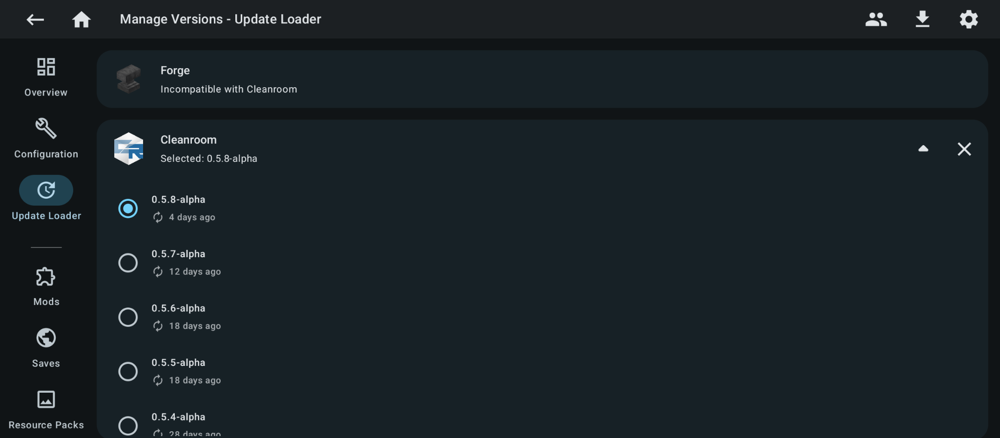

### 4. Install and confirm

Press **Install**, then **Confirm**. The instance will be updated to use Cleanroom.

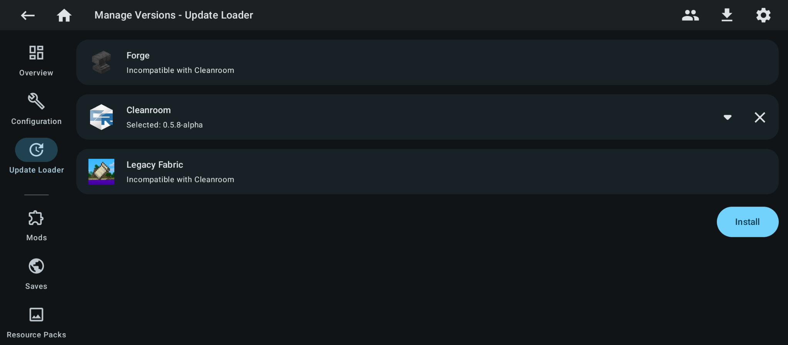

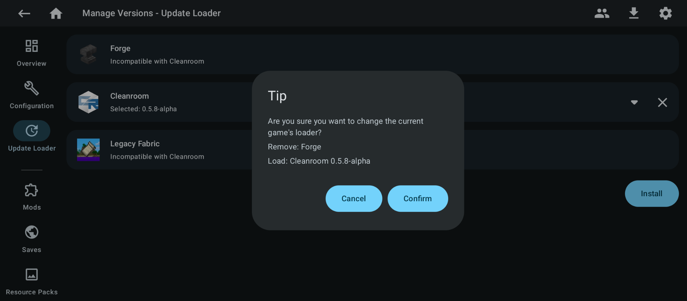

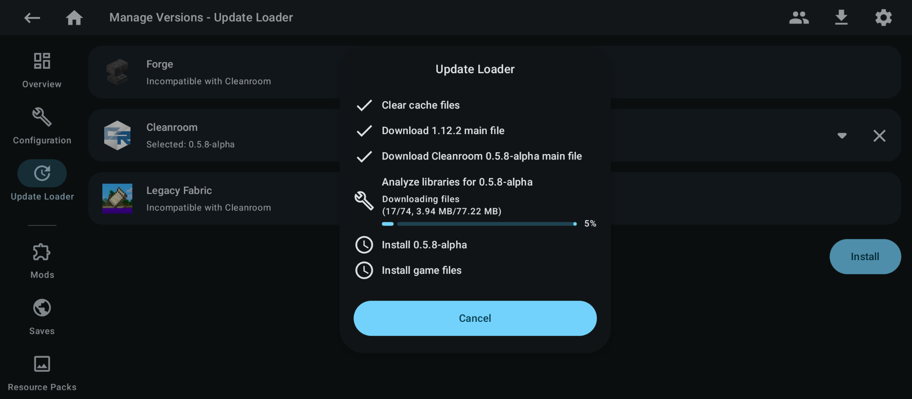

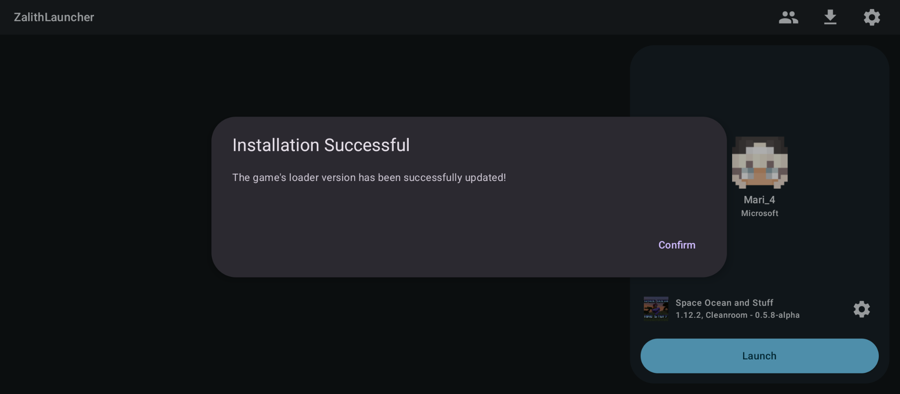

## Troubleshooting

### Use Internal Java 25

If the instance does not run after installation, open the instance’s settings and change the **Java Runtime** from “Follow the global setting” to **Internal-25**.

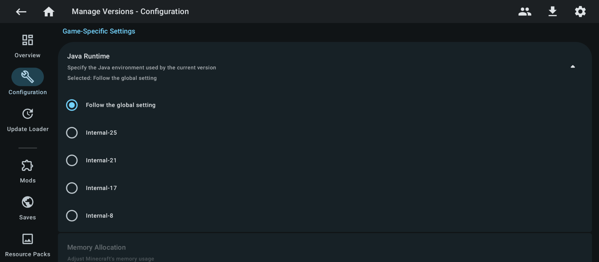

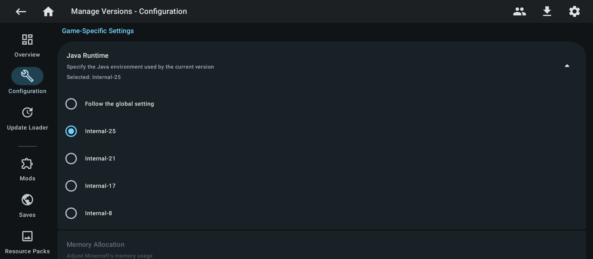
